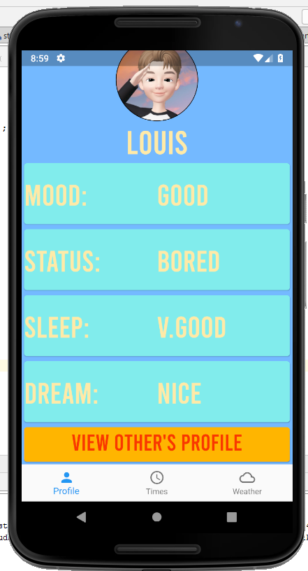
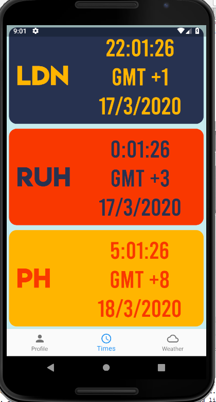
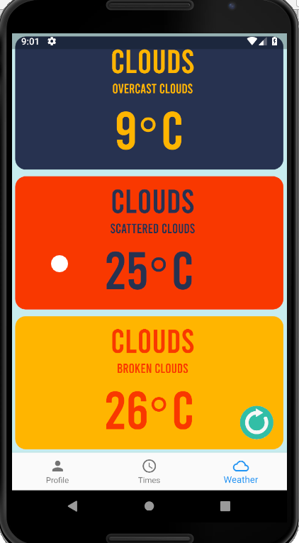

# Social App

Our-Time

## Getting Started

This project is a Flutter application, which would also use a server backend but i have hardcoded inputs
for this repo.

This First Screen is your profile and by holding down on any tile you can change it. you can also see other peoples profiles if i added a friends system but i do have a example one if you click on the orange button.

Just some world time harcoded in.

This is live weather reports for the corresponding zones in time.

A few resources to get you started if this is your first Flutter project:

- [Lab: Write your first Flutter app](https://flutter.dev/docs/get-started/codelab)
- [Cookbook: Useful Flutter samples](https://flutter.dev/docs/cookbook)

For help getting started with Flutter, view our 
[online documentation](https://flutter.dev/docs), which offers tutorials, 
samples, guidance on mobile development, and a full API reference.
